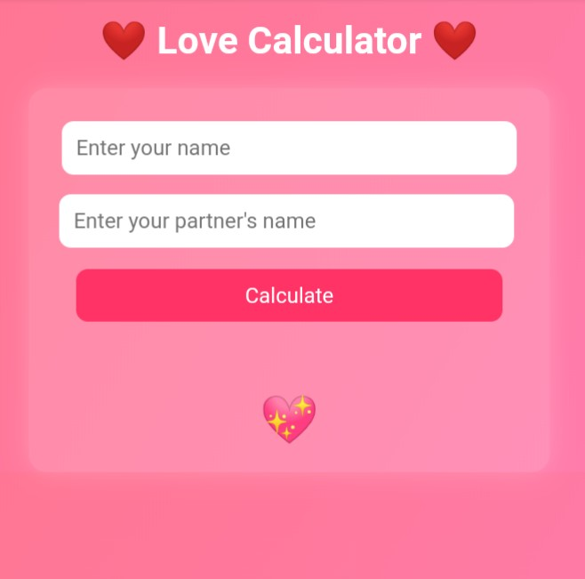

# Love Calculator ❤️ — Calculate your love

A fun and romantic web app that calculates your love score based on names. Whether you're curious, playful, or just in the mood for some digital affection, this app adds a spark to your day.

🔗 **Live Demo:** [https://bogglo.github.io/](https://bogglo.github.io/)

---

## 🌟 Features

- 💞 Animated love score reveal  
- 💖 Floating heart effects  
- 📱 Mobile & 💻 Desktop friendly  
- 🎨 Custom favicon and gradient background

---

## 🖼️ Preview

---

## 🚀 How to Use

1. Enter your name and your partner's name.  
2. Click **Calculate**.  
3. Watch the animated love score appear with floating hearts!

---

## 🛠 Tech Stack

- **HTML5** — structure and semantic tags  
- **CSS3** — styling, gradients, animations  
- **JavaScript** — DOM manipulation, logic, interactivity

---

## ✨ Author

Made with ❤️ by **All Bayjid (Bogglo)**  
📧 GitHub: [https://github.com/bogglo](https://github.com/bogglo)

---

## 📜 License

This project is open-source and free to use under the MIT License.
